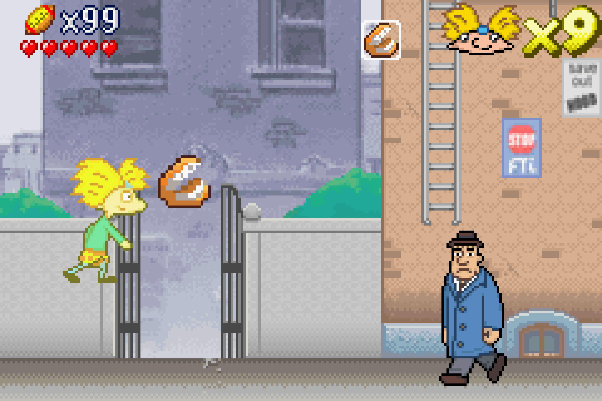
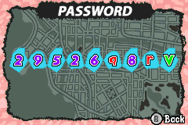
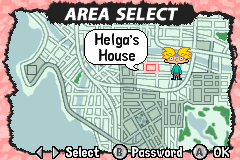

# Hey Arnold! The Movie video game of GBA

## Game password

The game password is `29526q8rV` can unlock all levels completed, all yellow tomatoes collected, 9 lives, 99 football heads, power-up items, red tomato and even bonus secret Helga room.

Screenshot from the video game:

Area selection:

## Cheat codes

Cheat codes was written, tested and done by Martin Eesmaa

**Europe prototype test and final version:**

| Description | Code Breaker | More info |
| --- | --- | --- |
| Hide weapon icon of HUD | `33000024 00A0` `33000026 00F0` | ? |
| Hide head icon of HUD | `3300002C 00A0` `3300002E 00F0` | ? |
| Animation character movement in menu | `0038`* | ? |
| Language selection force | `33001510 0000` (default: English) | 00 - English, 01 - French, 02 - German |
| Game password | `1680`* | 9 bytes password |
| Area | `3300168A` | 00: DEFAULT (Arnold's Street), 04: Nick's Living Room, 08 - The tunnel, 0C - FTI's Building, 10 - City Street, 14 - Helga's room |
| CHARACTER | `3300168C 0000` (default from daylight Arnold) | 00-01: ARNOLD, 02-03: GERALD, 04-05: GRANDPA PHIL, 06-07: GRANDMA GERTIE, 08-09: GERALD BUS, 0A-0B: HELGA (even numbers of light brightness, odd numbers dark brightness) |
| Put the character behind | `3300168F 0003` | ? |
| Remove the enemies | `33001690 0001` | ? |
| Mailboxes? | `1AAC`* | `FFFF33` I don't know yet? |
| Yellow tomato | `33001AB8 00FF` `33001ABA 00FF` `33001ABB 00F0` | Collects all yellow tomatoes |
| All levels completed | `33001ABC 00FF` `33001ABE 00FF` | Make all levels done |
| Force Helga mode | `33001AD6 0001` | Activate to be Helga character (English 1, French 2, German 4) |
| Buttons pressed | `1AD8`* | You could always change between Arnold and Helga of characters without pressing every single buttons: `28 46 64 82` |
| Activate make through end? | `22D0`* | ? |
| Football head shapes | `3300239E 0063` | Unlimited football heads |
| Lives | `330023A0 0009` | Unlimited lives |
| Hearts | `3300239C 0005` | Unlimited hearts |
| No hit | `33003E01 0001` | No hit |
| Jump up | `33004156 0001` | Gives jump high |
| Speed up | `33004157 0001` | N/A |
| Power up | `33004158 0001` | N/A |
| Star | `3300415D 0001` | Music star begins and you can hit enemies out (warning: at the boss stages may break) |
| Red tomato | `330047C6 0001` | Unlimited red tomatoes |
| Paper | `330047C8 0001` | Unlimited papers |
| Donut | `330047CA 0001` | Unlimited donuts |
| Basketball | `330047CC 0001` | Unlimited basketballs |
| Toilet paper | `330047CE 0001` | Grandma Gertie's item |
| Teeths | `330047D0 0001` | Grandpa Phil's item |
| Gum | `47D2`* | Default weapon |
| Unknown 1 | `5A88`* | No clip, make it bypass and also you can't hit the enemies (aktiveeri 00) |
| Boss HP length | `33005C64 0000` | Only at the boss stages |

- 2026 Martin Eesmaa
